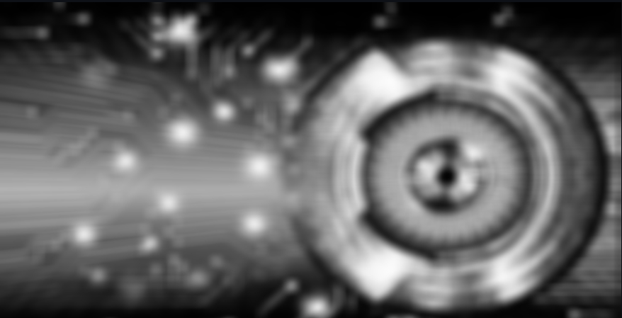

# 📸 Image Processing Streamlit App

Welcome to the **Image Processing Streamlit App**! This application allows you to perform various image processing tasks without using built-in functions. 🚀

## 🎯 Features

- **Upload Images**: Easily upload images for processing.
- **Basic Image Manipulations**: Perform basic manipulations such as resizing, cropping, and rotating images.
- **Filters and Transformations**: Apply custom filters and transformations to enhance your images.
- **Interactive Interface**: Use an intuitive and interactive interface to see the results in real-time.

## 🛠️ How It Works

This app is built using [Streamlit](https://streamlit.io/) and custom Python functions for image processing. Here’s how you can get started:

### 1. Clone the Repository

```bash
git clone https://github.com/BaranBicen/Image-Processing/tree/main
cd Image-Processing
```

### 2. Install Dependencies

Make sure you have Python installed. Then, install the required packages:

```bash
pip install numpy, plotly, streamlit
```

### 3. Run the App

Start the Streamlit app:

```bash
streamlit run Home.py
```

### 4. Upload and Process Images

- **Upload an Image**: Use the file uploader to select an image.
- **Choose Processing Options**: Select the image processing operations you want to apply from the sidebar.
- **View Results**: See the processed image.

## 🖼️ Example Images

| Original Image | Processed Image |
|:--------------:|:---------------:|
|  |  |

## 🔧 Custom Image Processing Functions

Here are some of the custom functions implemented in this app:

### Apply Filter

Grayscale
```python
def convert_grayscale(img):
    gray_img = np.dot(img[..., :3], [0.2989, 0.5870, 0.1140])
    gray_img = gray_img / 255.0
    return gray_img
```

Binary Filter
```python
def convert_binary(img, threshold):
    gray_img = convert_grayscale(img)
    binary_image = (gray_img >= threshold) * 255
    return binary_image
```


## 📚 Learn More

For more information on how to use and contribute to this project, please check out the [wiki](https://github.com/BaranBicen/Image-Processing/tree/main).

## 🤝 Contributing

Contribution is welcome but don't forget to give me some credit.

## 🌟 Acknowledgements

Special thanks to the [Streamlit](https://streamlit.io/) team and the open-source community for their amazing tools and resources.
